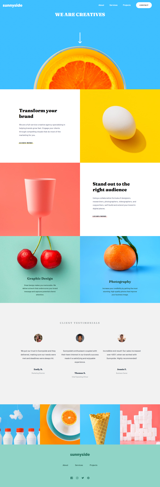

# Frontend Mentor - Sunnyside agency landing page 

This is a solution to the [Sunnyside agency landing page challenge on Frontend Mentor](https://www.frontendmentor.io/challenges/sunnyside-agency-landing-page-7yVs3B6ef).

## Screenshot

## Links

- Solution URL: [GitHub repo](https://github.com/TimWang95/sunnyside-agency-landing-page)
- Live Site URL: [solution Demo](https://lucent-praline-ec32b2.netlify.app/)

## Built with

## What I Learnd
- Using useState to control the navbar menu and products index.
- Using `window.innerWidth` gets the inner width of the window.
- Making a jumping arrow animation.

## Author
- [GitHub](https://github.com/TimWang95)

- [Forntend Mentor](https://www.frontendmentor.io/profile/TimWang95)

## Acknowledgments

- Challenge was provided by [Frontend Mentor](https://www.frontendmentor.io/home)
